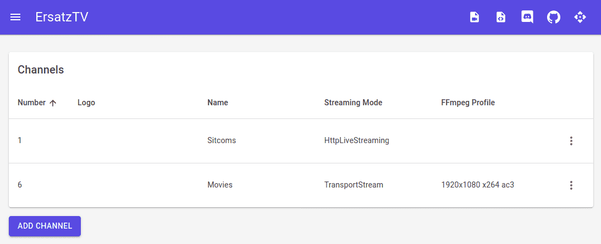

# ErsatzTV

**ErsatzTV** is pre-alpha software for configuring and streaming custom live channels using your media library. The software is currently unstable and under active development.

Want to join the community or have a question? Join us on [Discord](https://discord.gg/hHaJm3yGy6).

## Current Features

- Use local media files and optional sidecar [NFO metadata](https://kodi.wiki/view/NFO_files); no need for a full media server
- IPTV server and HDHomeRun emulation support a wide range of client applications
- Channel-specific streaming mode (MPEG-TS or HLS) and transcoding settings
- Automatic creation of television media collections
- Powerful scheduling options such as chronological collection playback throughout the day or over multiple days
- OpenAPI spec for easy scripting from other languages (available while running at `/swagger/v1/swagger.json`)
- Command line project for easy shell scripting

## In Development

- [Plex](https://www.plex.tv/) media, metadata and collections
- Published Docker image
  
## Planned Features

- [Jellyfin](https://jellyfin.org/) media, metadata and collections 
- Meta collections to logically group other collections
- Run as a Windows service
- Spots to fill unscheduled gaps

## Preview

### ErsatzTV UI



### Plex Live TV


Sintel is © copyright Blender Foundation | durian.blender.org

## Running ErsatzTV

The easiest way to run ErsatzTV is with Docker:

```
docker run -d \
  -e TZ=America/Chicago \
  -p 8989:8989 \
  -v /path/to/appdata/config:/root/.local/share/ersatztv \
  -v /path/to/shared/media:/path/to/shared/media:ro \
  --restart unless-stopped \
  jasongdove/ersatztv
```

After running ErsatzTV for the first time, configure it by visiting the web UI at http://[address]:8989.

## Development

See [development documentation](docs/development.md).

## License

This project is inspired by [pseudotv-plex](https://github.com/DEFENDORe/pseudotv) and
the [dizquetv](https://github.com/vexorian/dizquetv) fork and is released under the [zlib license](LICENSE).