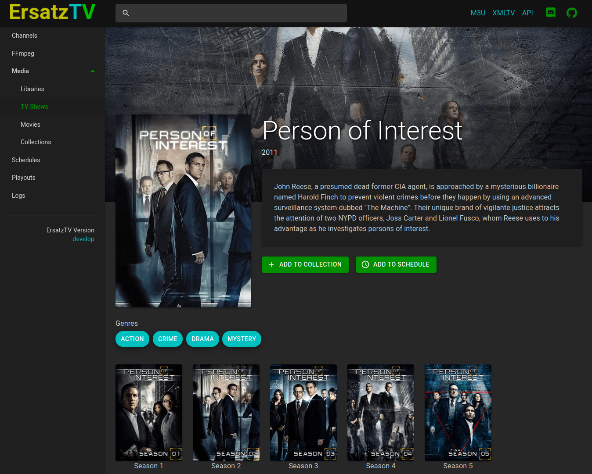
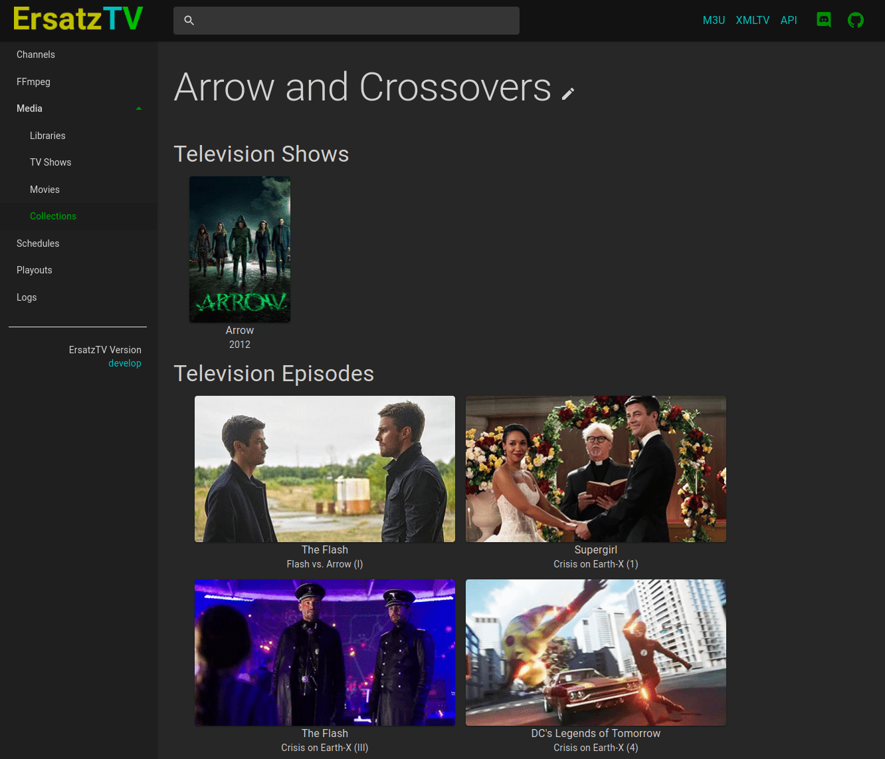
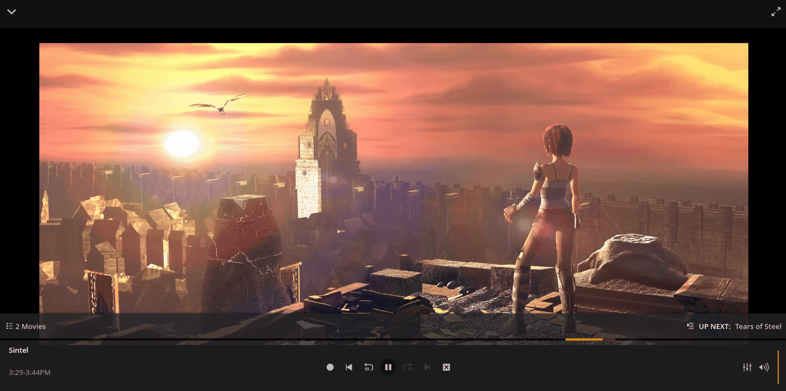

# ErsatzTV

**ErsatzTV** is pre-alpha software for configuring and streaming custom live channels using your media library. The software is currently unstable and under active development.

Want to join the community or have a question? Join us on [Discord](https://discord.gg/hHaJm3yGy6).

## Current Features

- Use local media files and optional sidecar [NFO metadata](https://kodi.wiki/view/NFO_files); no need for a full media server
- IPTV server and HDHomeRun emulation support a wide range of client applications
- Channel-specific streaming mode (MPEG-TS or HLS) and transcoding settings
- Collection-based scheduling, with collections containing television shows, seasons, episodes and movies
- Powerful scheduling options such as chronological collection playback throughout the day or over multiple days
- [Hardware-accelerated transcoding](#Hardware-Transcoding) options (QSV, NVENC, VAAPI)
- [Plex](https://www.plex.tv/) media and metadata

## In Development

- Music video libraries
 
## Planned Features

- [Jellyfin](https://jellyfin.org/) media, metadata and collections 
- Run as a Windows service
- Spots to fill unscheduled gaps

## Preview

### Television Show



### Media Collection



### Plex Live TV


Sintel is © copyright Blender Foundation | durian.blender.org

## Running ErsatzTV

The easiest way to run ErsatzTV is with Docker:

```
docker run -d \
  -e TZ=America/Chicago \
  -p 8409:8409 \
  -v /path/to/appdata/config:/root/.local/share/ersatztv \
  -v /path/to/shared/media:/path/to/shared/media:ro \
  --restart unless-stopped \
  jasongdove/ersatztv
```

After running ErsatzTV for the first time, configure it by visiting the web UI at http://[address]:8409.

### Software Transcoding

The following docker tags are available with software transcoding:

* `develop` - merges to `main` branch
* `latest` - latest release

### Hardware Transcoding

The following docker tags are available with hardware-accelerated transcoding:

* `develop-nvidia` - merges to `main` branch
* `develop-vaapi` - merges to `main` branch
* `latest-nvidia` - latest release
* `latest-vaapi` - latest release

QSV transcoding has not been tested in docker.

## Development

See [development documentation](docs/development.md).

## License

This project is inspired by [pseudotv-plex](https://github.com/DEFENDORe/pseudotv) and
the [dizquetv](https://github.com/vexorian/dizquetv) fork and is released under the [zlib license](LICENSE).