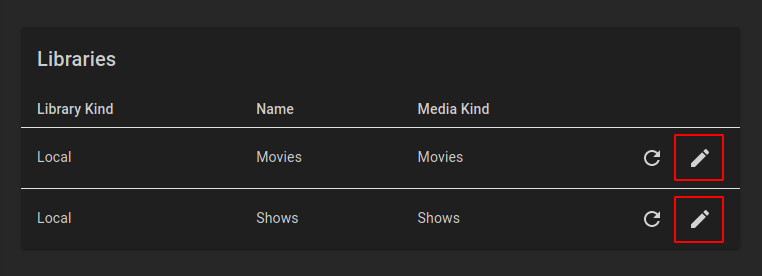

ErsatzTV needs to know about your media items in order to create channels.
Two library kinds are currently supported: [Local](#local-libraries) and [Plex](#plex-libraries).

## Local Libraries

ErsatzTV provides two local libraries, one for each supported media kind: `Movies` and `Shows`.

### Metadata

With local libraries, ErsatzTV will read metadata from [NFO files](https://kodi.wiki/view/NFO_files), falling back to a *minimal* amount of metadata if NFO files are not found.

### Add Media Items

To add media items to a local library under `Media` > `Libraries`, click the edit button for the library:

Then click the `Add Library Path` button and enter the path where your media files of the appropriate kind are stored:

Finally, click `Add Local Library Path` and ErsatzTV will scan and import your media items.

## Plex Libraries

Plex libraries provide a way to synchronize your media from Plex to ErsatzTV.
This synchronization process is one-way: changes made within Plex are synchronized to ErsatzTV.
ErsatzTV will never make any modifications to your Plex configuration or media.

### Metadata

With Plex libraries, Plex provides all metadata.

### Add Media Items

## Collections

ErsatzTV does not schedule individual media items; only collections of items can be scheduled.
To create a collection, find the media items you would like to include and select them by clicking the selection button in the top left of the poster:

Then, add to a collection by clicking the `Add To Collection` button at the top of the page.

In the `Add To Collection` dialog, either select an existing collection for the items, or enter a new collection name to create a collection and add all of the selected items in a single step.

