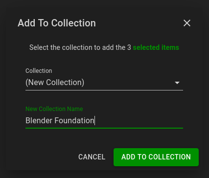

ErsatzTV needs to know about your media items in order to create channels.
Two library kinds are currently supported: [Local](#local-libraries) and [Plex](#plex-libraries).

## Local Libraries

ErsatzTV provides three local libraries, one for each supported media kind: `Movies`, `Shows` and `Music Videos`.

### Metadata

With local libraries, ErsatzTV will read metadata from [NFO files](https://kodi.wiki/view/NFO_files), falling back to a *minimal* amount of metadata if NFO files are not found.

### Add Media Items

To add media items to a local library under `Media` > `Libraries`, click the edit button for the library:

Then click the `Add Library Path` button and enter the path where your media files of the appropriate kind are stored:

Finally, click `Add Local Library Path` and ErsatzTV will scan and import your media items.

## Plex Libraries

Plex libraries provide a way to synchronize your media (metadata) from Plex to ErsatzTV.
This synchronization process is one-way: changes made within Plex are synchronized to ErsatzTV.
ErsatzTV will never make any modifications to your Plex configuration or media.

### Metadata

With Plex libraries, Plex provides all metadata.

### Add Media Items

#### Sign In

The add media items from Plex under `Media Sources` > `Plex`, click the `Sign in to Plex` button and sign in with your Plex account.

#### Synchronize Libraries

After signing in, select which libraries you would like to synchronize from Plex to ErsatzTV by clicking the `Edit Libraries` button for the desired Plex server.

In the libraries listing, click the `Synchronize` switch for all libraries you would like to synchronize from Plex to ErsatzTV, and click the `Save Changes` button to start the synchronization process.

### Path Replacements

Media items are not streamed from Plex media sources. Instead, ErsatzTV will attempt to play media items from disk using the same path that Plex uses to play the media item.
There are two ways to make this work:

1. Ensure ErsatzTV has access to exactly the same shares and mounts as Plex
2. Configure path replacements to tell ErsatzTV where it should look on its file system for a given Plex folder

Option 1 is recommended as it will "just work" without any further configuration.

To configure path replacements for a Plex media source, click the `Edit Path Replacements` button in the 

Click `Add Path Replacement` to add a new path replacement, and enter the `Plex Path` along with the equivalent `Local Path` for ErsatzTV.
Click `Save Changes` after you have created all needed path replacements.

## Collections

ErsatzTV does not schedule individual media items; only collections of items can be scheduled.
To create a collection, find the media items you would like to include and select them by clicking the selection button in the top left of the poster:

Then, add to a collection by clicking the `Add To Collection` button at the top of the page.

In the `Add To Collection` dialog, either select an existing collection for the items, or enter a new collection name to create a collection and add all of the selected items in a single step.

---

Big Buck Bunny: (c) copyright 2008, Blender Foundation / [www.bigbuckbunny.org](https://www.bigbuckbunny.org)

Sintel: © copyright Blender Foundation | [www.sintel.org](https://www.sintel.org)

Tears of Steel: (CC) Blender Foundation | [mango.blender.org](https://mango.blender.org)
