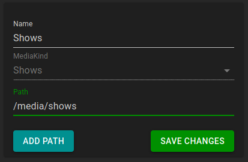

ErsatzTV needs to know about your media items in order to create channels.
Four library kinds are currently supported: [Local](#local-libraries), [Plex](#plex-libraries), [Jellyfin](#jellyfin-libraries) and [Emby](#emby-libraries).

## Local Libraries

Local libraries provide a way to schedule media directly from folders; no media server is necessary.

### Metadata

With local libraries, ErsatzTV will read metadata from [NFO files](https://kodi.wiki/view/NFO_files), falling back to a *minimal* amount of metadata if NFO files are not found.

### Add Libraries

ErsatzTV provides four local libraries by default, one for each supported media kind: `Movies`, `Shows`, `Music Videos` and `Other Videos`.
Additional libraries can be added under `Media Sources` > `Local`.

### Add Media Items

To add media items to a local library under `Media Sources` > `Local`, click the edit button for the library:

In the `Path` field, enter the path where your media files of the appropriate kind are stored:

Finally, click `Add Path`.

When you have added all of your media paths, click `Save Changes` and ErsatzTV will scan and import your media items.

## Plex Libraries

Plex libraries provide a way to synchronize your media (metadata) from Plex to ErsatzTV.
This synchronization process is one-way: changes made within Plex are synchronized to ErsatzTV.
ErsatzTV will never make any modifications to your Plex configuration or media.

### Metadata

With Plex libraries, Plex provides all metadata.

### Add Media Items

#### Sign In

To add media items from Plex, under `Media Sources` > `Plex` click the `Sign in to Plex` button and sign in with your Plex account.

#### Synchronize Libraries

After signing in, select which libraries you would like to synchronize from Plex to ErsatzTV by clicking the `Edit Libraries` button for the desired Plex server.

In the libraries listing, click the `Synchronize` switch for all libraries you would like to synchronize from Plex to ErsatzTV, and click the `Save Changes` button to start the synchronization process.

### Path Replacements

Media items are not streamed from Plex media sources. Instead, ErsatzTV will attempt to play media items from disk using the same path that Plex uses to play the media item.
There are two ways to make this work:

1. Ensure ErsatzTV has access to exactly the same shares and mounts as Plex
2. Configure path replacements to tell ErsatzTV where it should look on its file system for a given Plex folder

Option 1 is recommended as it will "just work" without any further configuration.

To configure path replacements for a Plex media source, click the `Edit Path Replacements` button in the 

Click `Add Path Replacement` to add a new path replacement, and enter the `Plex Path` along with the equivalent `Local Path` for ErsatzTV.
Click `Save Changes` after you have created all needed path replacements.

## Jellyfin Libraries

Jellyfin libraries provide a way to synchronize your media (metadata) from Jellyfin to ErsatzTV. This synchronization process is one-way: changes made within Jellyfin are synchronized to ErsatzTV. ErsatzTV will never make any modifications to your Jellyfin configuration or media.

### Metadata

With Jellyfin libraries, Jellyfin provides all metadata.

### Add Media Items

#### Connect to Server

Connecting to a Jellyfin server requires two settings: the server address and an api key.

##### Server Address

The server address is the address that you type in your web browser to access your Jellyfin server.

##### API Key

To create a Jellyfin API Key, from the `Admin / Dashboard` in Jellyfin, select `Advanced / API Keys` and click the `+` button near the top.

Give the API Key a name like `ErsatzTV` and click `Ok`. The API key is then displayed.

##### Configuration

Finally, in ErsatzTV, under `Media Sources` > `Jellyfin` click the `Connect Jellyfin` button, enter the `Address` and `Api Key` and click `Save Changes` to connect to your Jellyfin server.

#### Synchronize Libraries

After connecting, select which libraries you would like to synchronize from Jellyfin to ErsatzTV by clicking the `Edit Libraries` button for the desired Jellyfin server.

In the libraries listing, click the `Synchronize` switch for all libraries you would like to synchronize from Jellyfin to ErsatzTV, and click the `Save Changes` button to start the synchronization process.

### Path Replacements

Media items are not streamed from Jellyfin media sources. Instead, ErsatzTV will attempt to play media items from disk using the same path that Jellyfin uses to play the media item.
There are two ways to make this work:

1. Ensure ErsatzTV has access to exactly the same shares and mounts as Jellyfin
2. Configure path replacements to tell ErsatzTV where it should look on its file system for a given Jellyfin folder

Option 1 is recommended as it will "just work" without any further configuration.

To configure path replacements for a Jellyfin media source, click the `Edit Path Replacements` button in the

Click `Add Path Replacement` to add a new path replacement, and enter the `Jellyfin Path` along with the equivalent `Local Path` for ErsatzTV.
Click `Save Changes` after you have created all needed path replacements.

## Emby Libraries

Emby libraries provide a way to synchronize your media (metadata) from Emby to ErsatzTV. This synchronization process is one-way: changes made within Emby are synchronized to ErsatzTV. ErsatzTV will never make any modifications to your Emby configuration or media.

### Metadata

With Emby libraries, Emby provides all metadata.

### Add Media Items

#### Connect to Server

Connecting to a Emby server requires two settings: the server address and an api key.

##### Server Address

The server address is the address that you type in your web browser to access your Emby server.

##### API Key

To create a Emby API Key, from the `Admin / Manage Emby Server` in Emby, select `Advanced / API Keys` and click the `+ New Api Key` button near the top.

Give the API Key a name like `ErsatzTV` and click `Ok`. The API key is then displayed.

##### Configuration

Finally, in ErsatzTV, under `Media Sources` > `Emby` click the `Connect Emby` button, enter the `Address` and `Api Key` and click `Save Changes` to connect to your Emby server.

#### Synchronize Libraries

After connecting, select which libraries you would like to synchronize from Emby to ErsatzTV by clicking the `Edit Libraries` button for the desired Emby server.

In the libraries listing, click the `Synchronize` switch for all libraries you would like to synchronize from Emby to ErsatzTV, and click the `Save Changes` button to start the synchronization process.

### Path Replacements

Media items are not streamed from Emby media sources. Instead, ErsatzTV will attempt to play media items from disk using the same path that Emby uses to play the media item.
There are two ways to make this work:

1. Ensure ErsatzTV has access to exactly the same shares and mounts as Emby
2. Configure path replacements to tell ErsatzTV where it should look on its file system for a given Emby folder

Option 1 is recommended as it will "just work" without any further configuration.

To configure path replacements for a Emby media source, click the `Edit Path Replacements` button in the

Click `Add Path Replacement` to add a new path replacement, and enter the `Emby Path` along with the equivalent `Local Path` for ErsatzTV.
Click `Save Changes` after you have created all needed path replacements.

