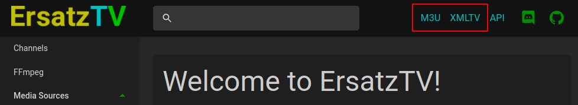
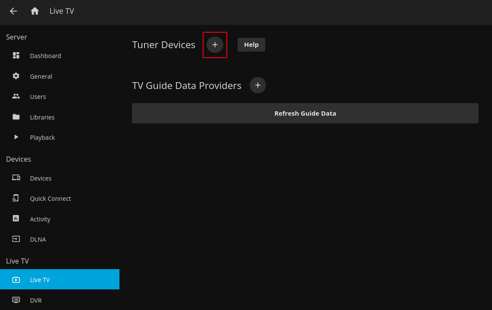
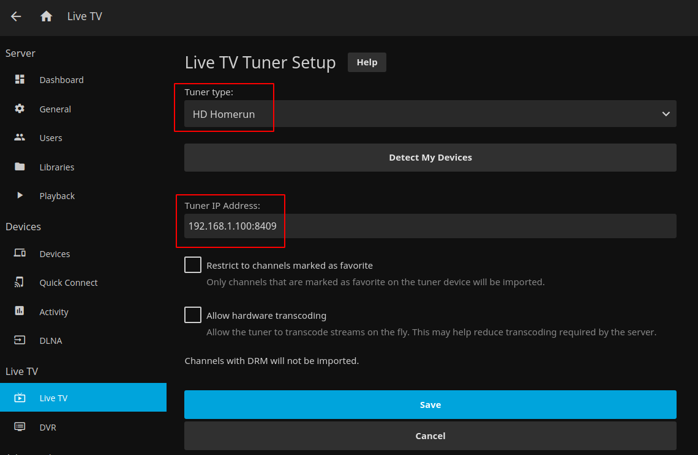
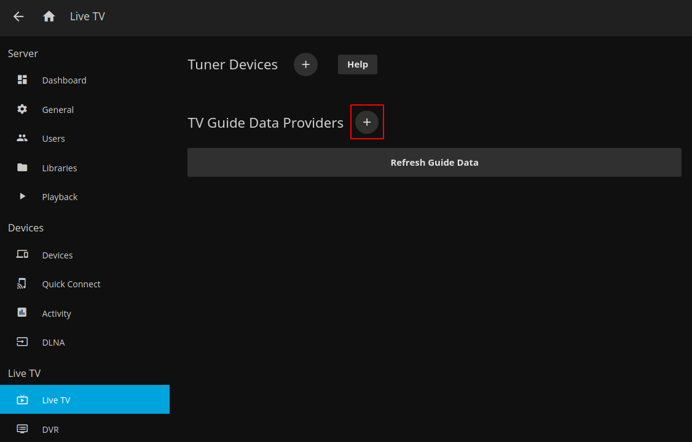
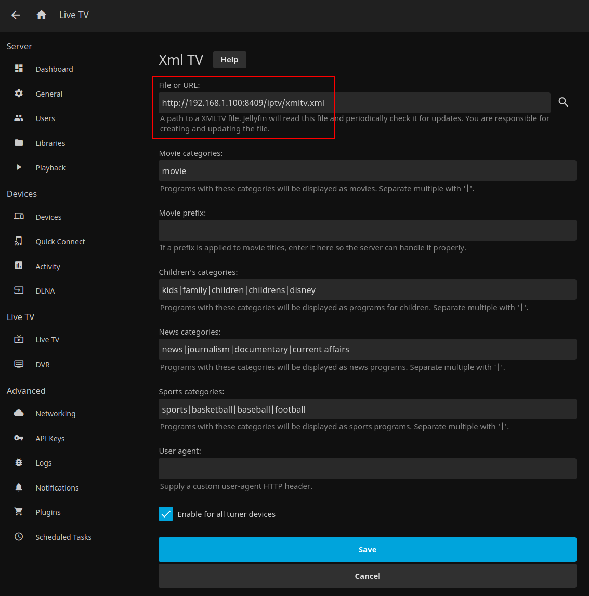

For all clients, the `M3U` and/or the `XMLTV` urls are needed and can be copied from the top right of the ErsatzTV UI.

## Plex

A [Plex Pass](https://www.plex.tv/plex-pass/) is required for ErsatzTV to work with Plex.

## Jellyfin

Jellyfin requires two steps to configure Live TV:

- [Add Tuner Device](#add-tuner-device)
- [Add TV Guide Data](#add-tv-guide-data)

### Add Tuner Device

From the Admin Dashboard in Jellyfin, click `Live TV` and `+` to add a new tuner device:

For `Tuner Type` select `HD Homerun`, and for `Tuner IP Address` enter ErsatzTV's IP address and port, like `192.168.1.100:8409` (use your server IP, not necessarily 192.168.1.100).

### Add TV Guide Data

From the Admin Dashboard in Jellyfin, click `Live TV` and `+` to add a tv guide data provider and select `XMLTV`.

Enter the `XMLTV` url from ErsatzTV and click `Save`.

## TiviMate

## Channels DVR

