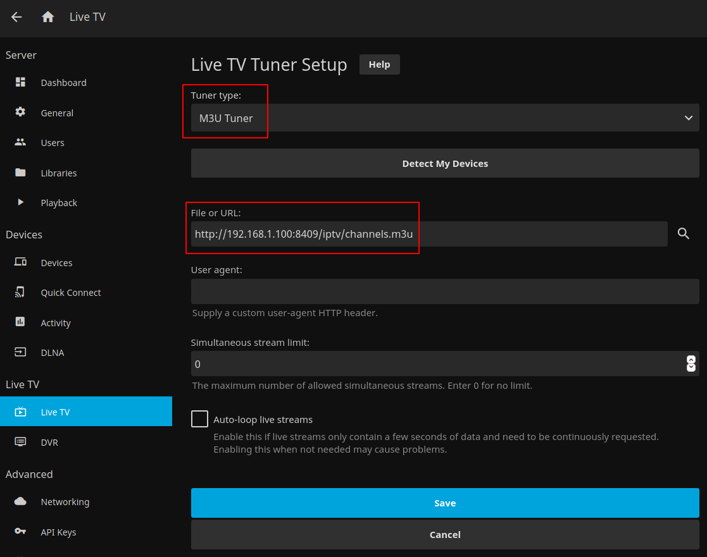
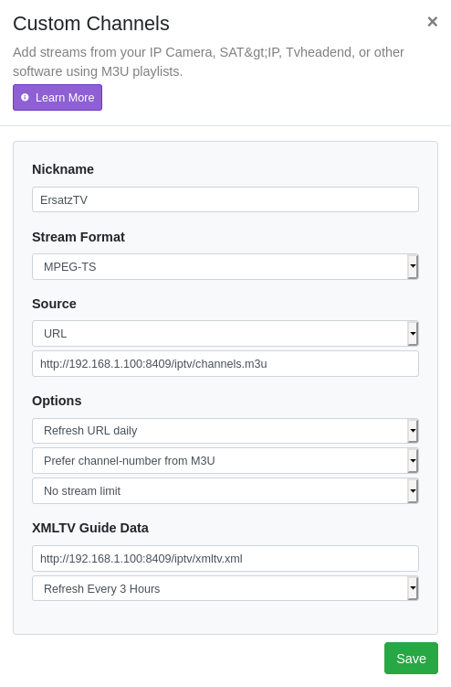

## Required Urls

For all clients, the `M3U` and/or the `XMLTV` urls are needed and can be copied from the top right of the ErsatzTV UI.

## Supported Clients

- [Plex](#plex)
- [Jellyfin](#jellyfin)
- [TiviMate](#tivimate)
- [Channels DVR Server](#channels-dvr-server)

## Plex

A [Plex Pass](https://www.plex.tv/plex-pass/) is required for ErsatzTV to work with Plex.

### Add DVR

From Plex Settings, click `Live TV & DVR` and  `Set Up Plex DVR` to add a new DVR.
If ErsatzTV is not automatically detected

  * Click to `enter its network address manually`
  * Enter ErsatzTV's IP address and port, like `192.168.1.100:8409` (use your server IP, not necessarily 192.168.1.100)
  * Click `Connect`

### Add XMLTV

Click `Continue` on the channel listing, then

  * Click `Have an XMLTV guide on your server? Click here to use that instead.`
  * Enter the `XMLTV` url from ErsatzTV (see [required urls](#required-urls)) and click `Continue`

Make any desired changes to the channels, then click `Continue` to complete DVR setup.

## Jellyfin

Jellyfin requires two steps to configure Live TV:

- [Add Tuner Device](#add-tuner-device)
- [Add TV Guide Data](#add-tv-guide-data)

### Add Tuner Device

From the Admin Dashboard in Jellyfin, click `Live TV` and `+` to add a new tuner device:

For `Tuner Type` select `M3U Tuner`, for `File or URL` enter the `M3U` url from ErsatzTV (see [required urls](#required-urls)), and click `Save`.

### Add TV Guide Data

From the Admin Dashboard in Jellyfin, click `Live TV` and `+` to add a tv guide data provider and select `XMLTV`.

Enter the `XMLTV` url from ErsatzTV (see [required urls](#required-urls)) and click `Save`.

## TiviMate

### Add Playlist

Start by adding a playlist under `Settings` > `Playlists` > `Add playlist`.
The playlist type is `M3U Playlist` and the url is the `M3U` url from ErsatzTV (see [required urls](#required-urls)).

Change the playlist name if desired, and leave `TV playlist` selected.

### Add EPG

The EPG url should be automatically detected by TiviMate, but can be manually entered as the `XMLTV` url from ErsatzTV (see [required urls](#required-urls)).

## Channels DVR Server

[Channels Plus](https://getchannels.com/plus/) is required for ErsatzTV to work with Channels (via Channels DVR Server).

### Add Custom Channel Source

In Channels DVR Server Settings, click `Add Source` and select `Custom Channels`.

- Give your custom channel source a name
- Select `MPEG-TS` as the stream format
- Enter the `M3U` url from ErsatzTV (see [required urls](#required-urls))
- Select `Refresh URL daily`
- Set a stream limit if desired (not required)
- Click `Save`

### Add Guide Data Provider

In Channels DVR Settings, click the gear icon next to the ErsatzTV channel source and select `Set Provider`:

Click the drop down next to zip code and select `XMLTV > Custom URL`:

Enter the `XMLTV` url from ErsatzTV (see [required urls](#required-urls)) and click `Save`.

