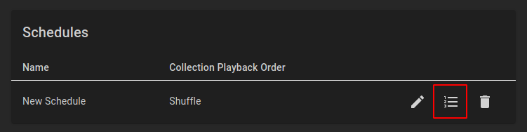

## Create Channel

Create a Channel by navigating to the `Channels` page and clicking `Add Channel`.

### Channel Number

Channel numbers can be whole numbers or can contain one decimal, like `500` or `500.5`.

### Streaming Mode

Two streaming modes are currently supported: `Transport Stream` and `HttpLiveStreaming`.
`Transport Stream` is considered stable and is recommended for most purposes.
`HttpLiveStreaming` is unstable and is not recommended for general use.

### FFmpeg Profile

FFmpeg Profiles are collections of transcoding settings that are applied to all content on a channel.
The default FFmpeg Profile is probably "good enough" for initial testing.

### Logo

Channel logos can be added using the `Upload Logo` button and the logos will display in most client program guides.

## Create Schedule

Schedules are used to control the playback order of media items on a channel.
Create a Schedule by navigating to the `Schedules` page, clicking `Add Schedule` and giving your schedule a name, a collection playback order, and clicking `Add Schedule` to confirm your selections.

### Collection Playback Order

Select the desired playback order for media items within each collection in the schedule:

- `Chronological`: Items are ordered by release date, then by season and episode number.
- `Random`: Items are randomly ordered and may contain repeats.
- `Shuffle`: Items are randomly ordered and no item will be played a second time until every item from the collection has been played once.

### Schedule Items

Schedules contain an ordered list of items (collections), and will play back one or more items from each collection before advancing to the next schedule item.

Edit the new schedule's items by clicking the `Edit Schedule Items` button for the schedule:

Add a new item to the schedule by clicking `Add Schedule Item` and configure as desired.

#### Start Type

Items with a `Dynamic` start type will start immediately after the preceding schedule item, while a `Fixed` start type requires a start time.

#### Collection Type

Schedule items can contain the following collection types:

- `Collection`: Select a collection that you have created manually.
- `Television Show`: Select an entire television show.
- `Television Season`: Select a specific season of a television show.

#### Collection

Based on the selected collection type, select the desired collection.

#### Playout Mode

Select how you want this schedule item to behave every time it is selected for playback.

- `One`: Play one media item from the collection before advancing to the next schedule item.
- `Multiple`: Play the specified `Multiple Count` of media items from the collection before advancing to the next schedule item.
- `Duration`: Play the maximum number of complete media items that will fit in the specified `Playout Duration` before either going offline for the remainder of the playout duration (an `Offline Tail`), or immediately advancing to the next schedule item.
- `Flood`: Play media items from the collection either forever or until the next schedule item's start time, if one exists.

Click `Save Changes` to save all changes made to the schedule's items.

## Create Playout

Playouts assign a schedule to a channel and individually track the ordered playback of collection items.
If a schedule is used in multiple playouts (channels), the channels may not have the same content playing at the same time.

To create a Playout, navigate to the `Playouts` page and click the `Add Playout` button. Then, select the appropriate channel and schedule, and click `Add Playout` to save.
