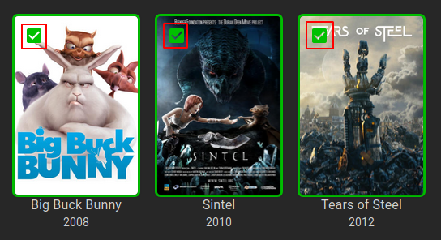
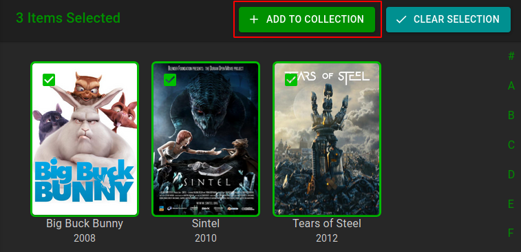
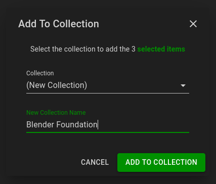
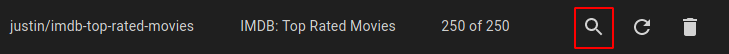

## Collection Types

ErsatzTV does not schedule individual media items; only collections of items can be scheduled. There are three (3) collection types:

- `Collection`: contains manually-added items
- `Smart Collection`: contains items from search results or imported Trakt Lists, and updates dynamically
- `Multi Collection`: contains other Collections and Smart Collections.

### Collections

Collections are created manually by adding individual media items to it. There is no restriction on media type. A collection can contain a single media type, eg. movies or any combination of media types.
The items to be added can be found by browsing your libraries or by using ErsatzTV's powerful Search feature. An empty collection can be created under `Lists` > `Collections` > `Add Collection`.

To create a collection, find the media items you would like to include and select them by clicking the selection button in the top left of the poster:

Then, add to a collection by clicking the `Add To Collection` button at the top of the page.

In the `Add To Collection` dialog, either select an existing collection for the items, or enter a new collection name to create a collection and add all of the selected items in a single step.

### Smart Collections

Smart Collections are created by saving searches or saving imported Trakt Lists.

#### From Searches

To create a smart collection, type a search query in the search box and press enter.
If the result shown meets your expectations, save as a Smart Collection by clicking the `Save As` button.
If it doesn't meet your expectations, refine the search query until it does and then save.

#### From Imported Trakt Lists

To import a Trakt List, navigate to the `Lists` > `Trakt Lists` page and click the `Add Trakt List` button.  Trakt lists can be imported by url or by `user/list`.

- To re-download a Trakt List, simply add it again. There is no need to delete.
- Unmatched item details are written to the log.
- Trakt Lists can only be scheduled after being saved as a Smart Collection.

To see matching items from an imported Trakt list, click the search button on the row of the Trakt List.

### Multi Collections

Multi Collections contain other Collections and/or Smart Collections. The primary purpose of these are to enable the scheduling of sets of Media Items in a controlled manner.
Here we are referring to Movie Boxsets, e.g. X-Men Collection, Star Trek Collection and Before... Collection as well as related movies and tv show groups such as Arrowverse, MARVEL Cinematic Universe, Worlds of DC and Battlestar Galactica (Reboot).

To Add a Multi Collection

- Navigate to `Lists` > `Collections` and click the `Add Multi Collection` button
- Give the Multi Collection a name
- Add collections and/or smart collections as required and click `Add Multi Collection` to save

---

Big Buck Bunny: (c) copyright 2008, Blender Foundation / [www.bigbuckbunny.org](https://www.bigbuckbunny.org)

Sintel: © copyright Blender Foundation | [www.sintel.org](https://www.sintel.org)

Tears of Steel: (CC) Blender Foundation | [mango.blender.org](https://mango.blender.org)
