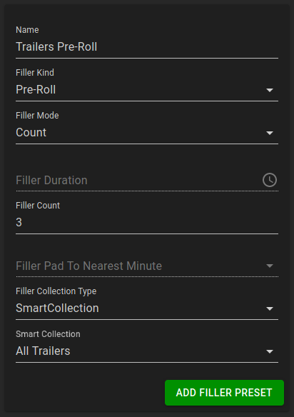
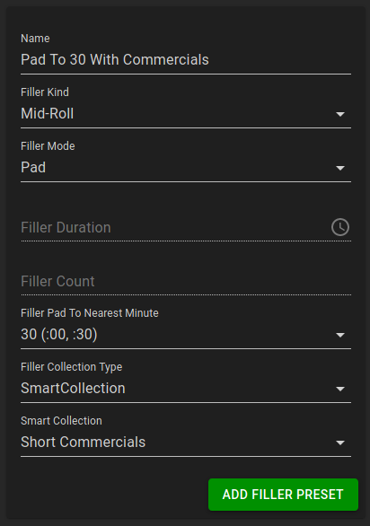

Filler is content that is used to fill otherwise unscheduled gaps, and to pad primary content to a desired time.

## Filler Kinds

There are a number of filler kinds supported by ErsatzTV:

- `Pre-roll`: filler that plays before each media item
- `Mid-roll`: filler that plays between chapters within each media item
- `Post-roll`: filler that plays after each media item
- `Tail`: filler that plays after all media items/filler and before the next schedule item
- `Fallback`: filler that is looped and cut as needed to fill any remaining gaps

## Filler Modes

`Pre-roll`, `mid-roll`, and `post-roll` filler support the following modes:

- `Count`: play a specific number of filler items from the collection
- `Duration`: play as many complete filler items that will fit in the specified duration
- `Pad`: after all other filler has been added, pad using additional filler until the wall clock minutes are a multiple of the selected number

## Filler Presets

To add filler to a schedule, a filler preset must first be created under `Lists` > `Filler Presets`.
Once a filler preset is created, it can be attached to any number of schedule items in the schedule items editor.

### Sample Preset: Trailers Pre-Roll

This preset will play exactly three items from the `All Trailers` smart collection before each media item.

### Sample Preset: Pad To 30 Minutes With Commercials

This preset will pad each media item to 30 minutes using items from the `Short Commercials` smart collection.
Because `mid-roll` is selected as the filler kind, the filler will be approximately evenly distributed between chapters.

