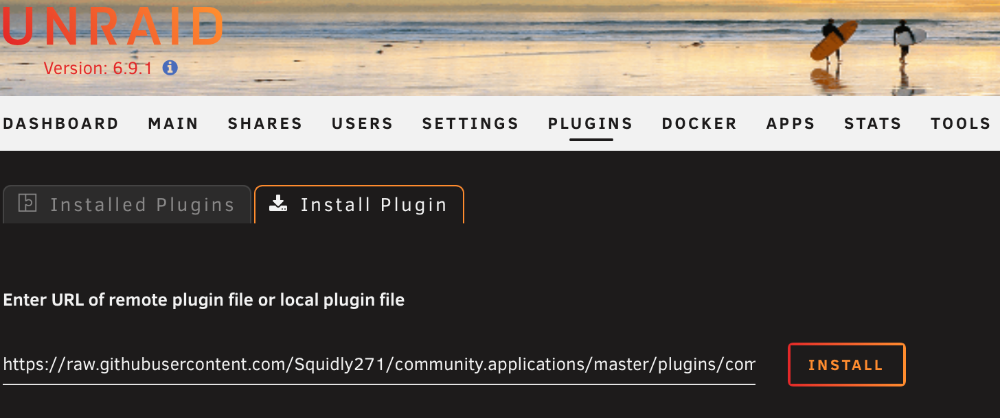
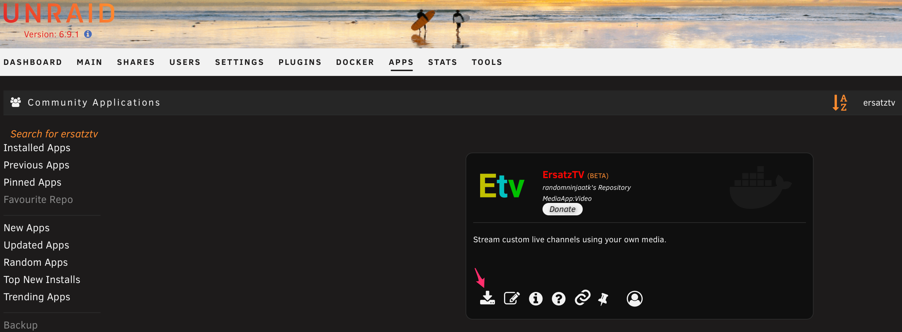
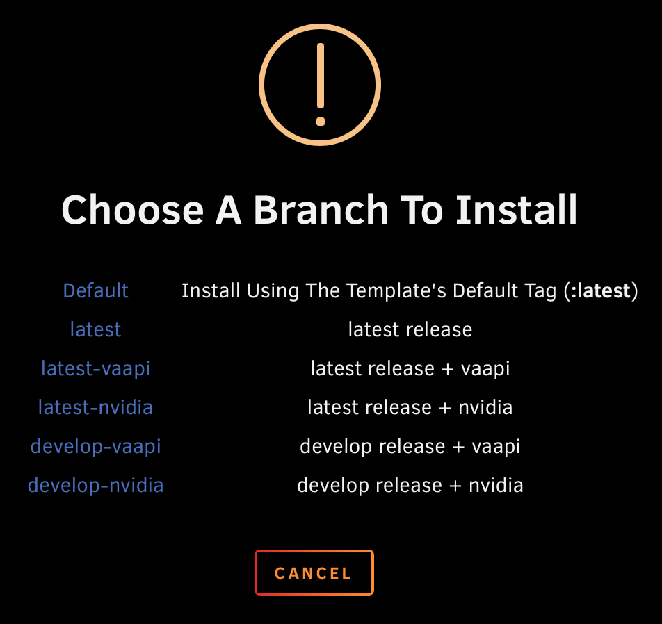
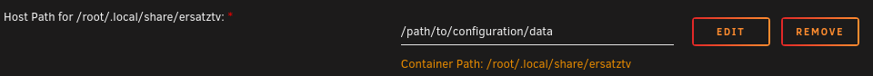
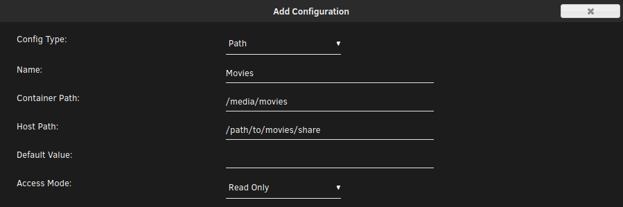
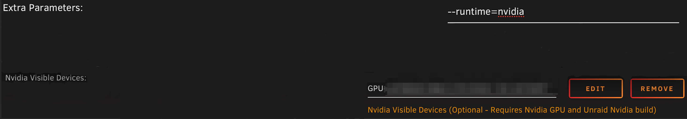

ErsatzTV is available as Docker images and as pre-built binary packages for Windows (x64), MacOS (x64, arm64) and Linux (x64, arm64, arm). 

## Docker Images

<a href="https://hub.docker.com/r/jasongdove/ersatztv"></a>

### Latest Release Tags

Base (software transcoding): `jasongdove/ersatztv:latest`

Nvidia hardware-accelerated transcoding: `jasongdove/ersatztv:latest-nvidia`

VAAPI (Intel, AMD) hardware-accelerated transcoding: `jasongdove/ersatztv:latest-vaapi`

### Development Tags

Development tags update much more frequently, but have the potential to be less stable than releases. 

Base (software transcoding): `jasongdove/ersatztv:develop`

Nvidia hardware-accelerated transcoding: `jasongdove/ersatztv:develop-nvidia`

VAAPI (Intel, AMD) hardware-accelerated transcoding: `jasongdove/ersatztv:develop-vaapi`

### Docker

1\. Download the latest container image

```
docker pull jasongdove/ersatztv
```

2\. Create a directory to store configuration data

```
mkdir /path/to/config
```

3\. Create and run a container

```
docker run -d \
  --name ersatztv \
  -e TZ=America/Chicago \
  -p 8409:8409 \
  -v /path/to/config:/root/.local/share/ersatztv \
  -v /path/to/shared/media:/path/to/shared/media:ro \
  --restart unless-stopped \
  jasongdove/ersatztv
```

### Unraid Docker

1. Install the Commuinity Applications plugin by pasting the following URL in the Plugins / Install Plugin section of UnRAID  

    ```
    https://raw.githubusercontent.com/Squidly271/community.applications/master/plugins/community.applications.plg
    ```  

    

2. Click on the `Apps` tab in UnRAID, search for `ersatztv`, and click the `install` button.

    

3. Choose an appropriate branch (Use `vaapi` for video acceleration for AMD GPUs and Intel CPUs with QuickSync, use `nvidia` for video acceleration for nVidia GPUs)

    
    `VAAPI` and `nVidia` branches are for hardware acceleration. See [latest release tags](install.md#latest-release-tags)

4. Map your path to ErsatzTV configuration data

    

5. Add another path for each media share

    

6. **OPTIONAL** In advanced view, add extra parameters for video acceleration. **NOTE** The [nVidia-Driver plugin](https://forums.unraid.net/topic/98978-plugin-nvidia-driver/) must be installed prior to this step.

    

7. Open your browser to `http://[docker-ip]:8409` (First run may take a few minutes to be available.)

## Development Builds

Development builds for all supported architectures can be found on the [develop release](https://github.com/jasongdove/ErsatzTV/releases/tag/develop).
As with the docker development tags, the development builds are updated with every push to the main branch and have the potential to be less stable than releases.

## Windows

### Manual Installation

1. Create a folder `ersatztv` at your preferred install location.
2. Download and extract the [latest release from GitHub](https://github.com/jasongdove/ErsatzTV/releases) to the `ersatztv` folder.
3. Run `ErsatzTV-Windows.exe`
4. Use the tray menu to open the UI, view logs or exit

## MacOS

### Manual Installation

1. Download the .dmg from the [latest release from GitHub](https://github.com/jasongdove/ErsatzTV/releases)
2. Open the .dmg and drag `ErsatzTV` to the `Applications` folder
3. Double-click the `ErsatzTV` application
4. Use the tray menu to open the UI, view logs or exit

## Linux

### Manual Installation

1. Create a folder `ersatztv` at your preferred install location.
2. Download and extract the [latest release from GitHub](https://github.com/jasongdove/ErsatzTV/releases) to the `ersatztv` folder.
3. Run `ErsatzTV`
4. Open your browser to `http://[server-ip]:8409`
